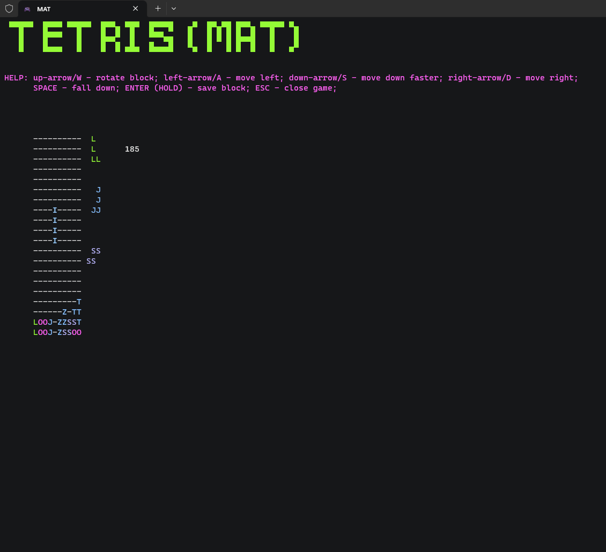

# MAT
--------
`Modern Arcade Tetris (MAT)` - is a clone of well-known game called Tetris, interpreted in console. It is written in C# and available on all platforms: Linux, MacOS and Windows. Though my repo includes only Windows build, but you can build Linux/MacOS executable on your own using .NET.

# Preview
--------------

# Launch
------------
Windows:
1. You have to open folder build/windows/;
2. Then double-click on `MAT.exe` file. And you're done;

Linux/MacOS (.NET installed required):
1. cd source_proj && dotnet run 

# Available
---------------
Available & Tested on all platforms: Linux, MacOS, Windows; 
Only Windows build available, for Linux/MacOS you have to build it uisng .NET;
